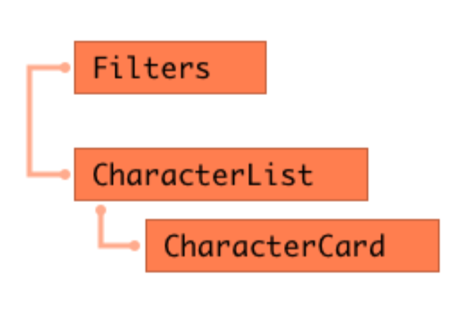

## Ejercicio evaluación final

El ejercicio consiste en desarrollar una página web con un listado de personajes de Harry Potter, que podemos filtrar por el nombre del personaje. Vamos a usar React para realizarlo.

### 1. Listado de personajes
En primer lugar, vamos a realizar una web con el listado de personajes de Harry Potter. Para eso, vamos a utilizar el servicio de http://hp‒api.herokuapp.com/ que nos devuelve información sobre 25 personajes de la saga. Sobre cada uno, vamos a pintar al menos:
1.nombre 
2.foto 
3.casa

### 2. Filtrado de personajes
Ahora que ya tenemos el listado de personajes en pantalla, la segunda parte consiste en poder buscarlos por nombre. Para eso, añadimos un input a la interfaz, de forma que al ir escribiendo un nombre queden en la interfaz solo los personajes cuyo nombre contiene las letras escritas. En el pantallazo de arriba, al escribir 'ha' aparecen personajes cuyo nombre completo contiene esas letras en ese orden.

### 3. Componentes del listado de personajes
El listado debe tener los siguientes componentes como mínimo:
Componente para los filtros
Componente para el listado
Componente para la tarjeta de cada personaje del listado
Como en el ejemplo:

  

### 4. Detalle de personajes
Vamos a implementar una nueva funcionalidad: al hacer clic sobre la tarjeta de un personaje, su información aparecerá a pantalla completa. Para hacer esto usaremos rutas y React router. En la pantalla de detalle aparecerá además de nombre, foto y casa, el año de nacimiento, el patronus y si está vivo o muerto al final de la saga.

### 5. BONUS: Mejoras visuales